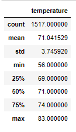

# SurfsUp Analysis
## Overview
While on vacation in Hawaii, JR made a plan to return and live forever by opening a Surf n Shake Shop.  He has some savings to invest but has also contacted an investor, W. Avy, who is interested but has been burned in the past and would like more information.
## Purpose
We have been asked to run analytics on the weather in Oahu using a provided weather dataset.
## Resources
Data:  SQLite database 
Software(s):  SQLAlchemy, Flask
## Results
We have provided our findings below that support our opinion that the weather is favorable year-round for the Surf n Shake Shop to be a viable venture and a sound investment.

We queried the data using the extract funtion, filtered for temperatures in the months of June and December, converted the results to lists, created dataframes from the lists and calculated summary statistics as shown below:
 
 
From the above, we identified the following key differences in weather between June and December.
1.  The mean (average) varied less than 4 degrees.
2.  The minimum temperatures varied 8 degrees.
3.  THe maximum temperatures varied 6 degrees.

## Summary
In addition, we performed additional queries to determine the most active weather station and gathered additional data for June and December.  These findings were in direct correlation with all stations.

In June, the minimum temperature was 65, the maximum temperature was 82, with an average temperature of approximately 73.
 

In December, the minimum temperature was 58, the maximum temperature was 79, with an average temperature of approximately 70.
 
